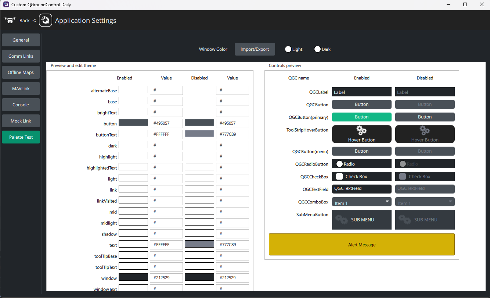

# Color Scheme

*All changes will be made within the custom folder*

## <a name="setup"></a>Setup
When changing the color scheme, there are 2 files you need to pay attention to:
 1. [CustomPlugin.cc](qgroundcontrol/custom/src/CustomPlugin.cc)
 2. [CustomPlugin.h](qgroundcontrol/custom/src/CustomPlugin.h)

These can be found in `src/` within the custom folder.

We have to ensure our *header (.h)* file is set up correctly to edit our *C++ (.cc)* file. If you have not edited each of these files from the example, you can skip to [Changing The Colors](ColorScheme.md#changingthecolors).

For an example file, please refer to the links above.

 - **CustomPlugin.h**
    - Start by adding `#include "QGCCorePlugin.h"` with the includes.
    - Create a class `class CustomPlugin;` to reference.
    - Add the class and the paletteOverride. It should look similar to this:
        ```
        class CustomPlugin : public QGCCorePlugin
        {
        public:
            CustomPlugin(QGCApplication* app, QGCToolbox *toolbox);
            ~CustomPlugin();

            void paletteOverride (QString colorName, QGCPalette::PaletteColorInfo_t& colorInfo) final;
        };
        ```
 - **CustomPlugin.cc**
    - Start by adding `#include "QGCPalette.h"`.
    - Create the Constructor and Destructor:
        ```
        CustomPlugin::CustomPlugin(QGCApplication *app, QGCToolbox* toolbox)
            : QGCCorePlugin(app, toolbox)
        {
            _options = new CustomOptions(this, this);
            _showAdvancedUI = false;
        }

        CustomPlugin::~CustomPlugin()
        {
        }
        ```    
    - Create the paletteOverride function:
        ```
        void CustomPlugin::paletteOverride(QString colorName, QGCPalette::PaletteColorInfo_t& colorInfo)
        {
        }
        ```

## <a name="changingthecolors"></a>Changing The Colors
 - **CustomPlugin.cc**
    - Within the paletteOverride function, you can specify which objects to override. Each object will have the same code structure; just by changing the string, you can alter the object you are overriding.  
        - An example would be:
            ```
            if (colorName == QStringLiteral("window")) {
                colorInfo[QGCPalette::Dark][QGCPalette::ColorGroupEnabled]   = QColor("#212529");
                colorInfo[QGCPalette::Dark][QGCPalette::ColorGroupDisabled]  = QColor("#212529");
                colorInfo[QGCPalette::Light][QGCPalette::ColorGroupEnabled]  = QColor("#ffffff");
                colorInfo[QGCPalette::Light][QGCPalette::ColorGroupDisabled] = QColor("#f8f9fa");
            }
            ``` 
        - All object that can be changed are
            - window
            - windowShade
            - windowShadeDark
            - text
            - warningText
            - button
            - buttonText
            - buttonHighlight
            - buttonHighlightText
            - primaryButton
            - primaryButtonText
            - textField
            - textFieldText
            - mapButton
            - mapButtonHighlight
            - mapIndicator
            - mapIndicatorChild
            - colorGreen
            - colorOrange
            - colorRed
            - colorGrey
            - colorBlue
            - alertBackground
            - alertBorder
            - alertText
            - missionItemEditor
            - hoverColor
            - mapWidgetBorderLight
            - mapWidgetBorderDark
            - brandingPurple
            - brandingBlue
    - The four lines represent different color settings:
        - **Dark mode**, **Enabled** 
            ```
            colorInfo[QGCPalette::Dark][QGCPalette::ColorGroupEnabled] = QColor("#212529");
            ```
        - **Dark mode**, **Disabled** 
            ```
            colorInfo[QGCPalette::Dark][QGCPalette::ColorGroupDisabled] = QColor("#212529");
            ```
        - **Dark mode**, **Disabled**
            ```
            colorInfo[QGCPalette::Light][QGCPalette::ColorGroupEnabled] = QColor("#ffffff");
            ```
        - **Dark mode**, **Disabled**
            ```
            colorInfo[QGCPalette::Light][QGCPalette::ColorGroupDisabled] = QColor("#f8f9fa");
            ```
    - Changing the hex value, e.g., `#212529` to a new value, will change the color for the respective object.
 - Make sure to **rebuild** and **run** your project to test out the colors.

## Testing the Palette
To view your Palette in a test environment, when you build and run your application in debug mode, under application settings, there is a tab called *Palette Test*, where you can see all color changes.



- If you don't see the *Palette Test* tab, there may be 2 reasons:
    - Ensure you are building in **debug mode**.
    - You might be overriding the settings page in **CustomPlugin.cc**. Rectify this by adding the following line in the function `CustomPlugin::settingsPages()` under `#if defined(QT_DEBUG)`: 
    ```
    _addSettingsEntry(tr("Palette Test"),   "qrc:/qml/QmlTest.qml");
    ``` 

---
[Next: Logo](Logo.md) \
[Prev: Getting Started](GettingStarted.md)