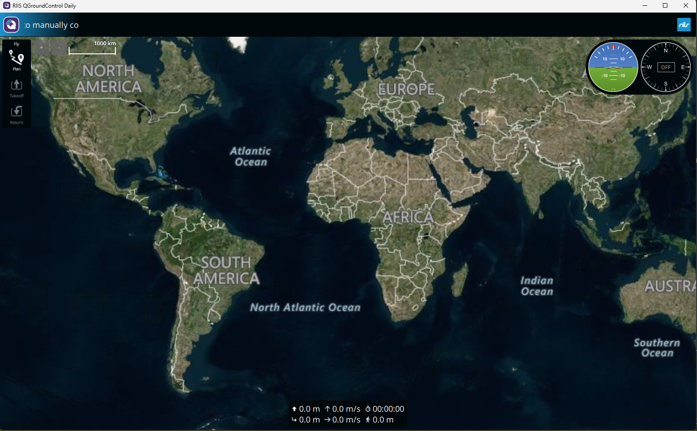
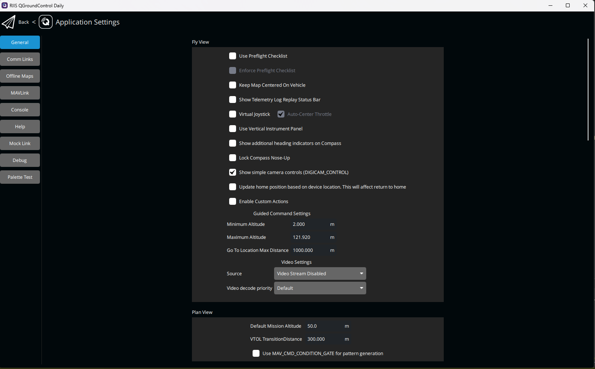

# Customizing QGroundControl
In this tutorial, we are going to go step by step on how to customize QGroundControl. We are going to cover things like:
 - Color Scheme
 - Logo
 - Fonts

With QGroundControl, it makes it easy to adjust these to make a more customized experience for your setup.

#### This tutorial assumes you have QT installed and all dependencies needed. 
If you need to install Qt, follow the [Guide to Install QT and QGroundControl](InstallingQt.md)

## Requirements
 - QT
 - Python

## Index 
 - [Getting Started](GettingStarted.md)
 - [Color Scheme](ColorScheme.md)
 - [Logo](Logo.md)
 - [Fonts](Fonts.md)

## Gallery

---
[Next: Getting Started](GettingStarted.md)
